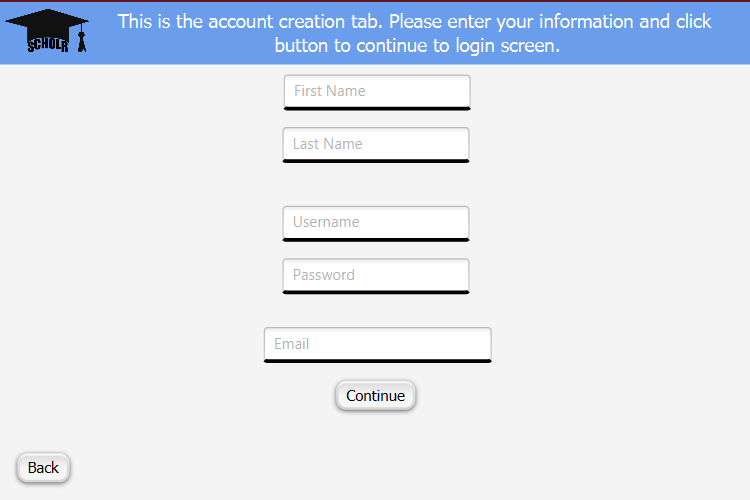
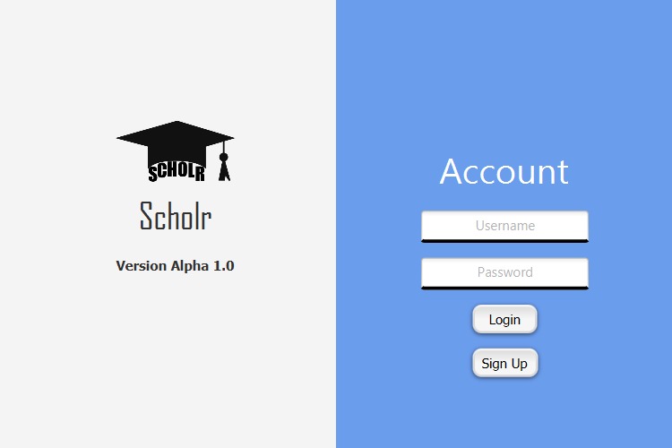
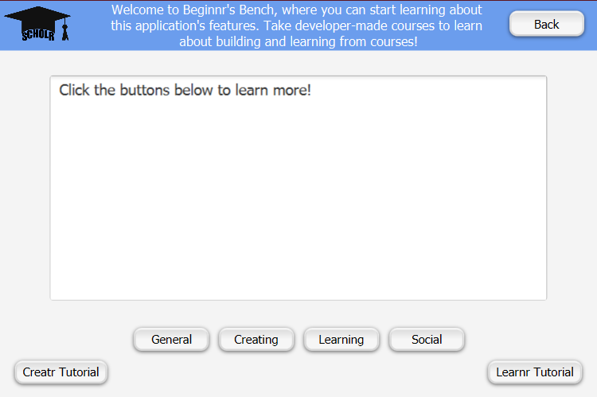
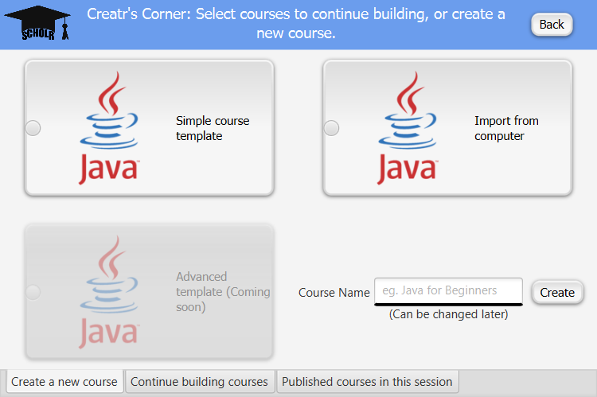
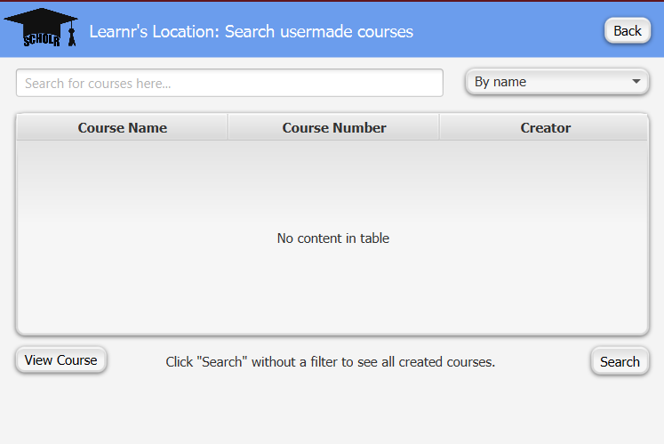

# Scholr - Version 1.0

## Introduction

**Scholr** is an all-in-one learning platform meant to engage
students and teachers alike in an easy-to-use and convenient package.

***

## Features

### Account system

#### Sign Up

New users can create accounts and start learning quickly and
easily straight from the startpage by clicking "Sign up".

#### Login

Returning users are able to immediately enter their username and 
password upon opening Scholr.

### Beginnr's Bench

Wondering where to start? Need a refresher after a break from Scholr?
Beginnr's Bench is perfect for you! Learn about the wide array 
of features Scholr has and how to create and learn from courses!

### Creatr's Corner

Are you an aspiring creator with content to show the world? Enter
Creatr's Corner: get started with our template to make a course!
Create paragraphs of content and various types of questions to test
learners! 

> As of version 1.0, the only template available is the Beginner
> Template. 

### Learnr's Location

Ready to learn something new? Use Learnr's Location to easily do
so! Search for user-made courses by name, author, and course code
and start learning!

> As of version 1.0, course search is limited (see Technologies).

### Social Spot

Wanting to get to know fellow users of Scholr? Use Social Spot
to:

- Add and message friends
- Follow creators

> As of version 1.0, the functionality of Social Spot has not been
> fully implemented yet.

***

## Technologies Used

### Database: Firebase - Firestore (Google Cloud)

> Was originally implemented using Amazon Web Services S3 and RDS.

Using the Google Cloud Firestore API and NoSQL.

### Email verification: Java Mail

The only emails that will be sent to your account will be for 
verification purposes!

***

## Version History

> Version 1.0

- Changed visibility to public
- Basic login/signup functionality implemented with new service
- Will continue adding to now outdated features after switch of services
- Known issue: jar file not working as intended under current parameters

Check back later for updates!
